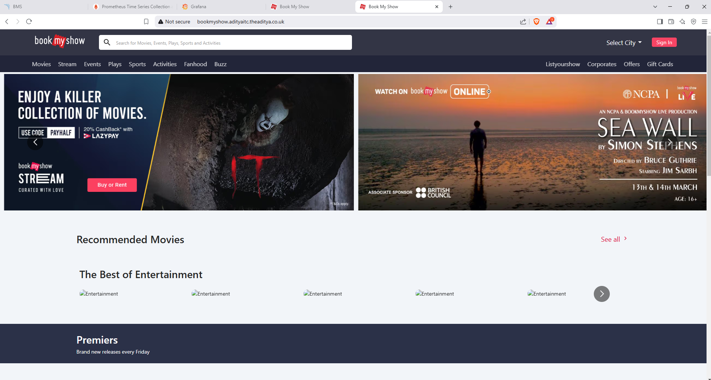
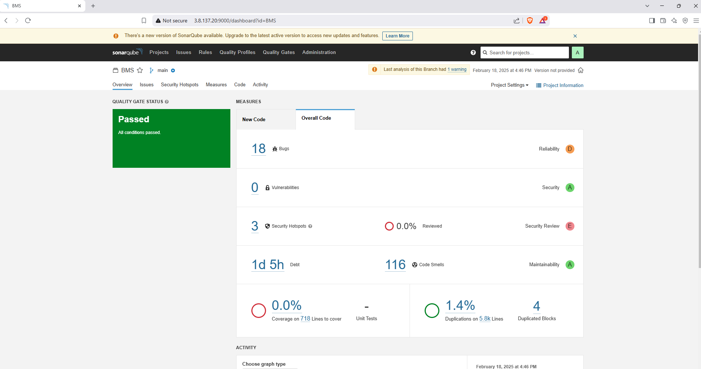
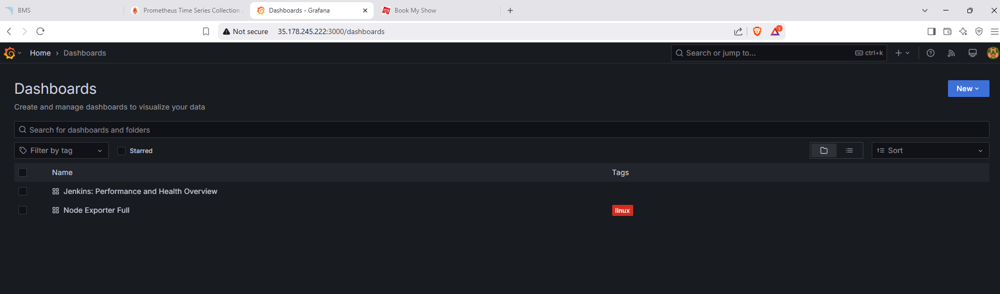
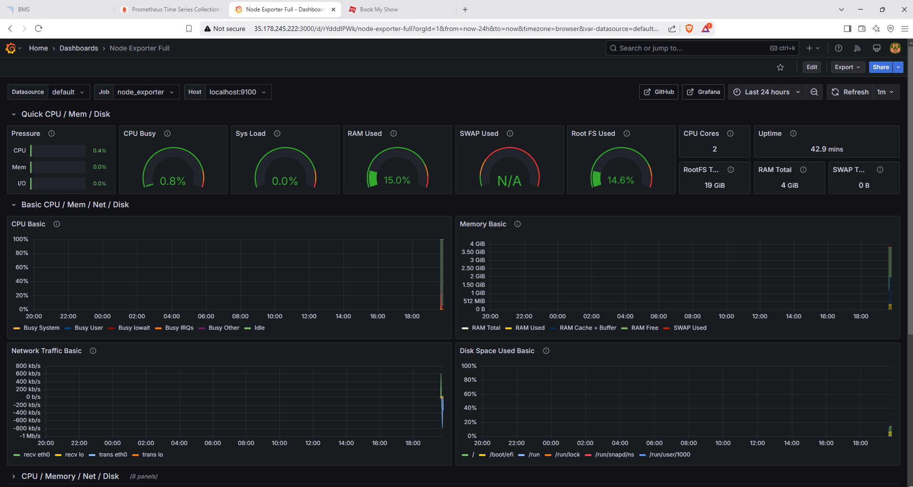
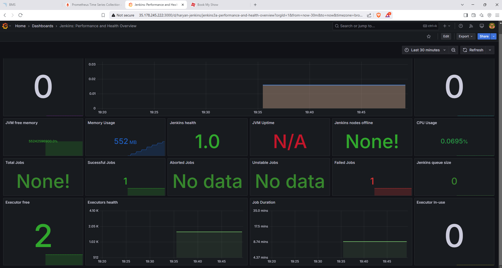

# **BOOK MY SHOW CLONE PROJECT**

## Create an EC2 Instance
- Size - t2.large 
- Security groups
```list
22 - SSH
25 - SMTP
465 - SMTPS
80 - HTTP 
443 - HTTPS
3000-1000 - APPLICATION PORTS
6443 - KUBERNETES API SERVER
30000 - 32767 - NodePort range 
IPv4 and IPv6 ICMP - For ping protocol 
```
- Login to the EC2 instance.

## EC2 Instance setup
- Installation of Jenkins, Run the jenkins.sh script to install jenkins. Access Jenkins service at http://EC2PUBLICIP:8080. 
- Installation of docker, Run the docker.sh script to install docker.
- Install Trivy, Run the trivy.sh script to install trivy.
- Install SonarQube, We will install sonarqube as a docker image. Access SonarQube service at http://EC2PUBLICIP:9000. Default username and password is admin <-> admin
```docker
docker run -d --name sonar -p 9000:9000 sonarqube:lts-community
```
- Install npm as we are working with a nodejs project.
```bash
sudo apt install -y npm
```

## Jenkins Server Configuration
- Install the following plugins in Jenkins, Manage Jenkins -> Plugins. Install the plugins, Post installation **Restart jenkins** as prometheus does not accept dynamic loading. Jenkins server has to be restarted **sudo systemctl restart jenkins**
```list
1. Pipeline: Stage View
2. Eclipse Temurin installer
3. SonarQube Scanner
4. NodeJS
5. OWASP Dependency-Check
6. Email Extension Template
7. Kubernetes Client API
8. Kubernetes Credentials
9. Kubernetes
10. Kubernetes CLI
11. Kubernetes Credentials Provider
12. Config File Provider
13. Prometheus metric
14. Docker
15. Docker Commons
16. Docker API
17. Docker Pipeline
18. Docker build step
```
- Before we configure SonarQube server with Jenkins Instance, for the jenkins to be able to talk to SonarQube server we need SonarQube token.
```list
1. Go to SonarQube UI 
2. Go to Administration -> Security -> Users 
3. Administrator -> Tokens -> Create a new token and Save it.
```
- Now in Jenkins lets add the following Credentials,  Manage Jenkins -> Credentials. Keep a **meaningful ID**  as it will be recognized by Jenkins Pipeline stages.
```list
1. SonarQube: Type - Secret text - ID{Sonar-token} - Secret text{SonarQubeToken}
2. DockerHub: Type - Username with password - ID{docker} - Username{DOCKERUSERNAME} - Password{DOCKERPASSWORD}
3. OWASP Dependency check - Secret text - ID{NVD_API_KEY} - Paste the secret text you got from NVD Link. Link can be found under ## Jenkins Pipeline Stages
4. Gmail: Type - Username with password - ID{email-creds} - Username{GMAILID} - Password{APPPASSWORD}
# To get gmail token go to Gmail account settings -> Seucurity -> Enable 2 step authentication if not yet done. Search for App Password -> Create an app password, this will be the secret text we will use with jenkins. Save the secret text, remove the spaces.
```
- Configure webhooks in SonarQube server, so that jenkins will be able to send the code for scanning into sonarqube
```list
1. Go to SonarQube server UI.
2. Administration -> Configuration -> Webhooks -> Create a webhook.
3. Name{jenkins-server} - URL{http://JSERVERPUBLICIP:8080/sonarqube-webhook/}
4. Create the webook
```
- Configure the following tools in Jenkins server, Manage Jenkins -> Tools. Keep a **meaningful name**  as it will be recognized by Jenkins Pipeline stages.
```list
1. JDK Installations -> Add JDK -> Name{jdk17} -> Install automatically -> Add Installer -> Install from adoptium.net{Because we installed the plugin Eclipse temurin installer} -> This plugin helps us choose the appropriate version we installed Java on the server. Choose {jdk-17.0.8+1}, any version can be choosen from OpenJDK 17's available options.
2. SonarQube Scanner installations -> Add SonarQube Scanner -> Name{sonar-scanner} -> version{latest-version}.
3. NodeJS installations -> Add NodeJS -> Name{node23} -> version{latest-version}.
4. Dependency-Check installations -> Add Dependency-Check -> Name{DP-Check} -> Install automatically -> Install from github.com. Automatically connects to github and installs the version selected. Go with latest version.
5. Docker installations -> Add Docker -> Name{docker} -> Install automatically -> Download from docker.com {latest version}.
6. Apply and Save
```
- Add the SonarQube Server IP address to Jenkins, Manage Jenkins -> System -> SonarQube servers -> Add SonarQube -> Name{sonar-server} - Server URL{http://3.8.137.20:9000} - Server authentication token{Choose the token we saved in credentials}. Apply and Save.
- Configure Email settings in Jenkins server to receive email post pipeline stages. 
- **Extended E-mail Notification**
```list
1. Go to Manage Jenkins -> System -> Extended E-mail Notification
2. SMTP server - smtp.gmail.com
3. SMTP Port - 465 {SMTPS PORT}
4. Advanced -> Credentials -> email-creds that we stored in Global Credentials.
5. Use SSL and OAuth 2.0
6. Default Content Type, Either HTML or Plain Text.
```
- **E-mail Notification**
```list
1. SMTP server - smtp.gmail.com
2. Advanced -> Username {GMAILID} - Password{APPPASSWORD} - Use SSL
3. SMTP Port - 465 {SMTPS PORT}
4. Reply-To Address{GMAILID}
5. Test configuration by sending email
6. If set up was successfull, you should see email notification on your Reply-To Address GMAIL ID.
```
- Setup Default triggers -> CTRL + F -> Search for Default Triggers -> Check **Success**, **Always** and **Failure-Any**. 
- Whenever a Job gets triggered, you will receive notification.

## Create an EKS Cluster.
- EKS cluster will server as out kubernetes platform.
- EKS cluster should not be created with root user account for security reasons.
- We will use an IAM user with required permissions and use the IAM user profile to create EKS cluster.
- Login with the IAM user using AWSCLI, To install AWSCLI run the script awscli.sh
- Login using the users Access key and Secret Access key.
- We need Kubectl to interact with the EKS cluster, so lets install Kubectl. To install kubectl, run the kubectl.sh script.
- To create EKS cluster we need **eksctl**. To install **eksctl**, run the eksctl.sh script.
- Once **eksctl** is installed lets create the EKS cluster. First without NodeGroup and add NodeGroup after cluster creation.
```bash
eksctl create cluster --name=${CLUSTER_NAME} \
                      --region=${CLUSTER_REGION} \
                      --zones=${CLUSTER_REGION}a,${CLUSTER_REGION}b \
                      --version=1.30 \
                      --without-nodegroup
```
- Associate **iam-oidc-provider** with the EKS cluster we created
```bash
eksctl utils associate-iam-oidc-provider \
    --region ${CLUSTER_REGION} \
    --cluster ${CLUSTER_NAME}\
    --approve
```
- The above command is crucial when setting up an EKS cluster because it enables IAM roles for service accounts (IRSA) 
- Amazon EKS uses OpenID Connect (OIDC) to authenticate Kubernetes service accounts with IAM roles.
- Associating the IAM OIDC provider allows Kubernetes workloads (Pods) running in the cluster to assume IAM roles securely.
- Without this, Pods in EKS clusters would require node-level IAM roles, which grant permissions to all Pods on a node.
- Without this, these services will not be able to access AWS resources securely.
- Create EKS node group, Use the SSH key stored in aws. EC2 -> Network & Security -> Key Pairs ${KeyPairName}. This Key Pair will be used to SSH into the nodes.
```bash
eksctl create nodegroup --cluster=${CLUSTER_NAME} \
                       --region=${CLUSTER_REGION} \
                       --name=node2 \
                       --node-type=t3.medium \
                       --nodes=${NUMBEROFNODES} \
                       --nodes-min=${MIN} \
                       --nodes-max=${MAX} \
                       --node-volume-size=20 \
                       --ssh-access \
                       --ssh-public-key=${adimsi} \
                       --managed \
                       --asg-access \
                       --external-dns-access \
                       --full-ecr-access \
                       --appmesh-access \
                       --alb-ingress-access
```

## Jenkins Pipeline Stages
- OWASP Dependency check, We need a NVD API Key for it to scan for OWASP Vulnerabilities even faster. Get you key from this website <a href="https://nvd.nist.gov/developers/request-an-api-key">Link</a>
- This Key should be passed in the stage **OWASP FS Scan**
```json
stage('OWASP FS Scan') {
            steps {
                dependencyCheck additionalArguments: '--scan ./ --disableYarnAudit --disableNodeAudit --nvdApiKey ${YOUR_NVD_API_KEY}', odcInstallation: 'DP-Check'
                dependencyCheckPublisher pattern: '**/dependency-check-report.xml'
            }
        }
```

## JENKINS USER SETUP
- Because in the pipeline, We are talking to EKS cluster. 
- We can either pass the **kubeconfig** file as a secret file in credentials and refer it or we can switch to Jenkins user and authenticate with AWS using awscli.
- Change to Jenkins user and authenticate with AWS.
```bash
sudo -su jenkins 
aws configure
aws sts get-caller-identity
```

## Monitoring
- Create an EC2 Instance of size **t2.medium** that we will use to monitor
- We will install **Prometheus** and **Grafana** on this instance.
- To install **Prometheus**, run the prometheus.sh script. Once installed access the UI at http://MonitoringServerPublicIP:9090. Go to Status -> Targets -> To see the targets.
- Install **Node Exporter**, run the node_exporter.sh script. Check the node exporter status - sudo systemctl status node_exporter.
- Integrate Jenkins with Prometheus server, Modify the prometheus.yml file at path /etc/prometheus/prometheus.yml. A sample file is given at prometheus.yml
```bash
sudo vi /etc/prometheus/prometheus.yml
# After modifying check the changes
promtool check config /etc/prometheus/prometheus.yml
# Reload prometheus
curl -X POST http://localhost:9090/-/reload
```
- To install **Grafana**, run the grafana.sh script. Once install access the gragana UI at http://MonitoringServerPublicIP:3000
- Once in the Grafana UI, We need to add Data sources as Dashboards.
- Data Sources -> Import Dashboard -> Prometheus -> Enable the togglebar -> URL {http://localhost:9090}
- Import 2 more Dashboards -> Import Dashboard -> Dashboar ID
- <a href="https://grafana.com/grafana/dashboards/1860-node-exporter-full/"> Node Exporter Dashboard Link </a> Get the Dashboard ID and paste it in the Grafana and Load -> Select prometheus as Data source and save.
- <a href="https://grafana.com/grafana/dashboards/9964-jenkins-performance-and-health-overview/">Jenkins Dashboard</a> Get the Dashboard ID and paste it in the Grafana and Load -> Select prometheus as Data source and save.

## DNS
- Get the load balancer name and add a record in your DNS service. Type: CNAME


### Images
- **Domain Resolved Application UI**
- **SonarQube Server Scan Report**
- **List Of Dashboards**
- **Node Exporter Dashboard**
- **Jenkins Job Stats Dashboard**
- **Prometheus Targets Dashboard**
